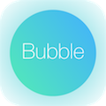
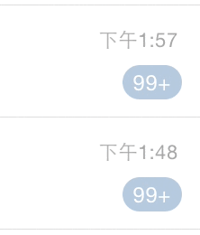

#XHBubbleView
---
  
XHbubbleView is the UI components(circle bubble) with drag and disappear effect. This is a implementation of one UI functionality from Tencent QQ application.  

##Demo
---
  
###Addition Implementation
*	Bubble float effect: **XHBubbleView Extension**
*	Bubble disappear animation: **XHSmokePuffImageView**

##Usage
---
###Init
New a BubbleOptions strcut.  

```swift
struct BubbleOptions {
    var text: String = ""
    var bubbleWidth: CGFloat = 0.0
    var viscosity: CGFloat = 0.0
    var bubbleColor: UIColor = UIColor.whiteColor()
}

var option = BubbleOptions()
option.viscosity = viscosity
option.bubbleWidth = bubbleWidth
option.bubbleColor = bubbleColor
```  
Initiate the XHBubbleView  .

```swift
let bubbleView = XHBubbleView(point: CGPoint, superView: UIView, options: BubbleOptions, enableSound: Bool, enableDisappear: Bool)
```
###Disappear & Sound Option
Bubble disappear when drap reach the viscosity limit:  

```swift
bubbleView.disappearEnable = true
```
Bubble bounce back when drap reach the viscosity limit:  

```swift
bubbleView.disappearEnable = false
```

Bubble disappear with sound effect:  

```swift
bubbleView.soundEnable = true
```

##Installation
---
Copy **XHBubbleView.swift** to your project.  

###Additional Installation
If you wanna enable bubble disappear effect, please copy all of he below file to your project:  

*	**XHSmokePuffImageView.swfit**  
*	animation image resource: **smoke1.png**, **smoke2.png**, **smoke3.png**, **smoke4.png**, **smoke5.png**  
*	disappear sound effect: **puff_smoke.m4a**